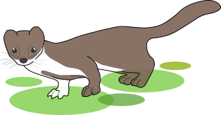

# _Mustela felipei_ repository

  <b>There and back again: Present and future habitat suitability of the Colombian Weasel <i>Mustela felipei</i> (Carnivora: Mustelidae)</b> 
  <b>Omar Daniel Leon-Alvarado, Alejandro José Biganzoli-Rangel, Andressa Paladini</b> 

***
In this repository you will find all the scripts and data used in our work. All scripts are under the license [GPL V3](https://www.gnu.org/licenses/gpl-3.0.html),so feel free to used them, but do not forget to cites us. Every folder have a README file with a brief decription of the files that are inside, so take your time to read them (are really short).

Finally, we created a interactive map with the main results of our work, if you want to explore it please visit the follow link: [Interactive Map](https://rpubs.com/oleon12/683824)

 

